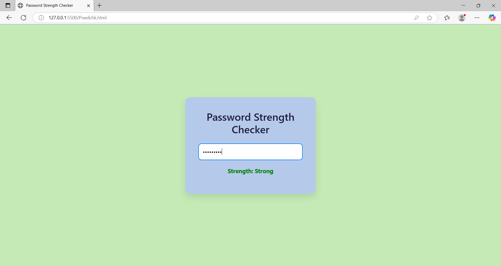

# 🔐 SecurePass Checker

A lightweight, responsive Password Strength Checker built using HTML, CSS, and JavaScript.  
It provides real-time feedback on password strength based on length, uppercase letters, numbers, and special characters.

---

## 📌 Features

- ✅ Real-time password strength analysis
- ✅ Checks for length, uppercase, numbers, and symbols
- ✅ Visual strength indicator (Weak, Medium, Strong)
- ✅ Responsive and mobile-friendly design
- ✅ Simple, clean, and easy-to-use interface

---

## 🛠️ Tech Stack

- HTML5  
- CSS3  
- JavaScript

---

## 🚀 Getting Started

1. Clone the repository or download the ZIP.
2. Open `index.html` in your browser.
3. Start typing in the password field to see strength analysis in action.

---

## 📸 Screenshot

  
*Real-time password strength feedback based on complexity.*

---

## 📁 File Structure

securepass-checker/
│
├── index.html # Main structure of the web page
├── style.css # Styling and layout
├── script.js # Password strength logic
├── screenshot.png # App preview image
└── README.md # Project overview

---

## 🤝 Contributing

Contributions are welcome!  
Feel free to fork this repo and submit a pull request.

---

## 📄 License

This project is open-source and free to use under the [MIT License](LICENSE).

---

## 🙋‍♂️ Author

**Mohammed Aafaq**  
[GitHub Profile](https://github.com/mohammedaafaq) • [LinkedIn](https://www.linkedin.com/in/mohammed-aafaq-dev/)

